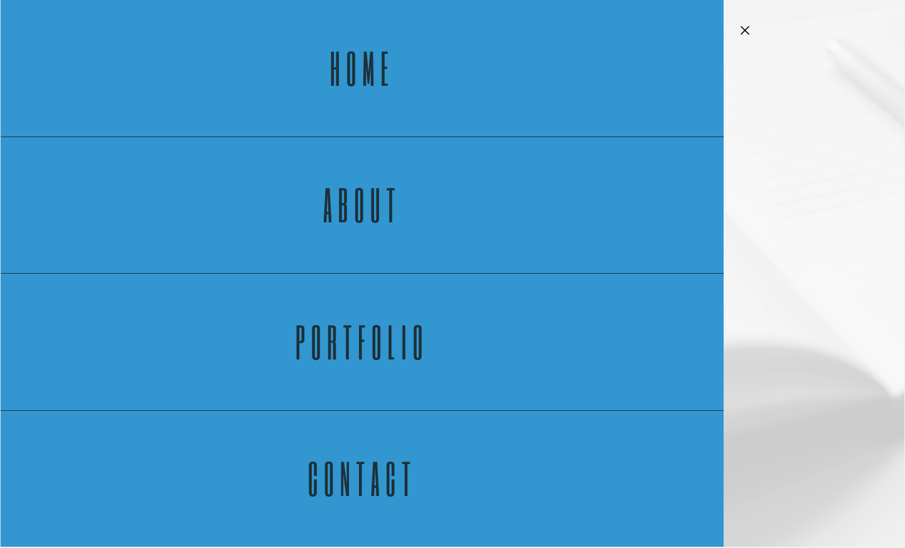

# <My-Portfolio-Website>

# My Portfolio Website

## Summery
This is a professional materials with links of various applications.
It is also responsive to different screens.

## Built with

* [HTML](https://developer.mozilla.org/en-US/docs/Web/HTML)
* [JavaScript](https://developer.mozilla.org/en-US/docs/Web/JavaScript)
* [CSS](https://developer.mozilla.org/en-US/docs/Web/CSS)

## Link
You can experience the deployed project here: [My Portfolio Website URL ](https://hadisparsa.github.io/my-website/).

## The following screen shots shows the web application's appearance and functionality:

## The web menu aprience: 

